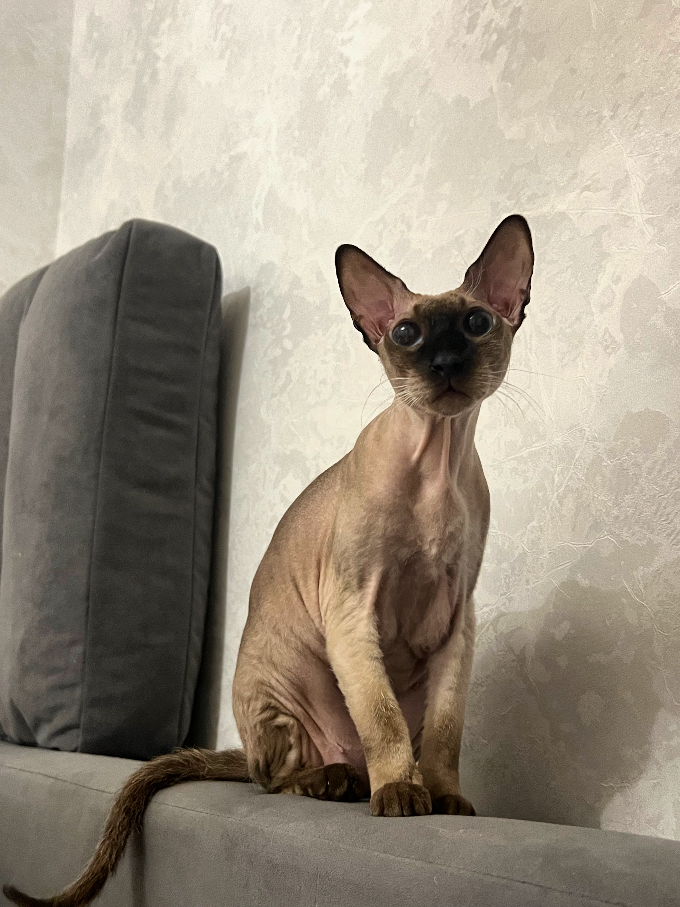

# Привет, меня зовут Галынина Яна Михайловна 

Это мой первый проект на GitHub Pages.

## Несколько фактов обо мне:

1. Я являюсь студентом Нетологии.
2. Прохожу обучение на курсе "Инженер по ручному тестированию"
3. Изучаю Git и GitHub
4. У меня есть кошка породы Питерболд, её зовут Шелби 

## Фото 1.

## Фото 2.
