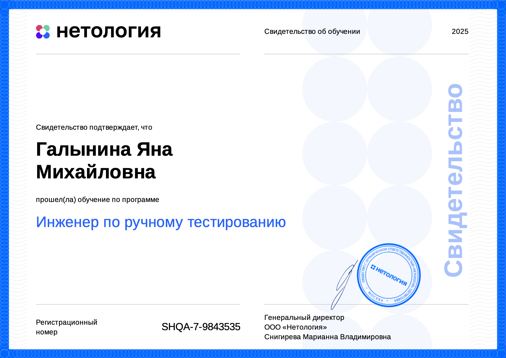

# Привет! Вот мое резюме

## Должность: Инженер по ручному тестированию (Junior)

**Имя:** Галынина Яна Михайловна

**Контакты:**
- Телефон: +79990264191
- Email: yana_galynina@mail.ru
- Telegram: @tretyakovaayana
- Город: Санкт-Петербург (готова к удалённой работе)

## Цель

Получение первого коммерческого опыта в тестировании. Хочу попробовать себя в деле, получить обратную связь от опытных коллег, постепенно прокачивать навыки и вырасти в IT-специалиста. Готова выполнять задачи качественно и развиваться вместе с компанией.

## Образование и курсы

- **Нетология**, курс «Инженер по ручному тестированию» (2025–2026)

## Навыки

- Составление тест-кейсов, чек-листов и баг-репортов
- Понимание жизненного цикла багов
- Основы тест-дизайна (эквивалентность, граничные значения)
- Базовое понимание клиент-серверной архитектуры
- Внимательность к деталям и усидчивость
- Грамотная устная и письменная речь
- Быстрая обучаемость и ответственность

## Инструменты

- Postman (базовый уровень)
- Git (базовый уровень)
- JMeter (базовый уровень)
- Jira (ознакомлена)

## О себе

Внимательная, ответственная. Легко нахожу общий язык в команде. Готова к обратной связи и быстрому обучению.

**Рассматриваю:** полную занятость, частичную занятость и стажировку.

